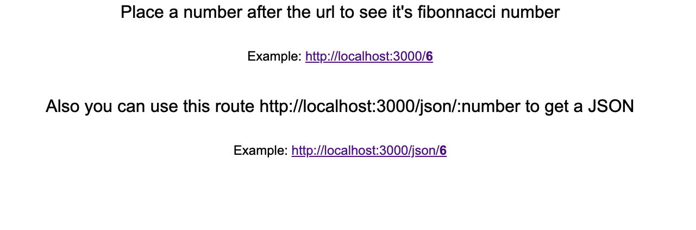

 # ControlHub Software Engineering Candidate Code Challenge
## Description: 
This project is a solution for ControlHub Software Engineering Candidate Code Challenge, is build with Node JS and Express. 

The project is an Rest API that have two different endpoints, one will return a response in the viewport and the other will return a JSON.

## Dependencies: 


## Instalation:
Clone this repo and place in the root of the project in your bash, then run this command:
```bash
npm install
```
## Usage

Place in the root of the project in your and run one of the following commands:

`Run in development mode with nodemon`
```bash
npm run dev
```
`Run with node js`
```bash
npm run start
```

Open your browser in `http://localhost:3000` and follow the instruction inside. You should see this in your browser.


To reciebe the fibonacci values of the numbers you want, place in your browser

`http://localhost:3000/:number`
to see in the viewport ot use this route

`http://localhost:3000/json/:number`
to se a JSON response

## Problem Description:
Fibonacci Rest API
Scenario: There is a need for a Rest (or Rest-like) API that can receive an index "n" and returns the Fibonacci value that corresponds to the given index, and you have been tasked with implementing the first version of this API.

Examples: the first values of the Fibonacci sequence are 0, 1, 1, 2, 3, 5, 8, 13, ..., so, if we were to give the API the index n=3, we should get the response value "2", and if we request n=6, we should get "8" as the response, and so on.

Please deliver to us your API as a link to a repo (Gitlab, Github, etc...) with your code and a README file (plaintext or markdown).

The code project can be developed in the programming language of your choice.

The README file is for you to describe your thought process. You can document: technical decisions that you made, what optimizations you could add in the future to improve upon your initial solution, and anything else you would like to add for us to get a better understanding of your engineering thinking.